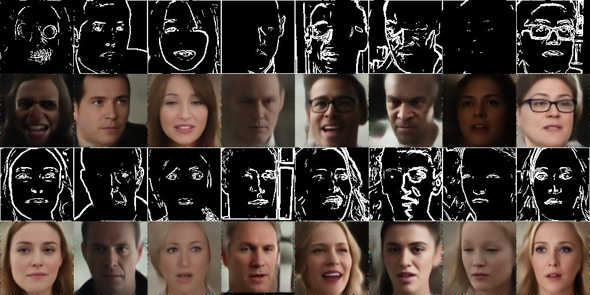

# edge2face

Trains a model that takes a canny edge image as input and generates a face.

## example

## references
- [Trailer Faces HQ Dataset](https://huggingface.co/datasets/justinpinkney/trailer-faces-hq)
- [Adabelief-Optimizer](https://github.com/juntang-zhuang/Adabelief-Optimizer)
